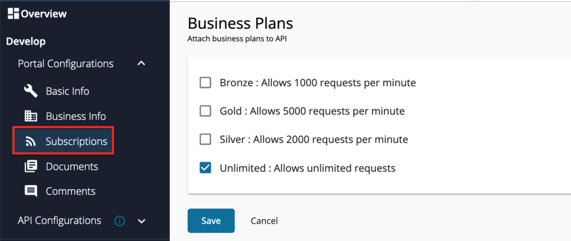
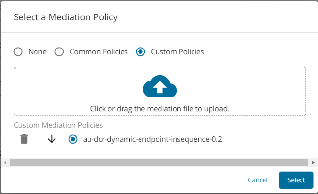

This page explains how to onboard an Accredited Data Recipient application using the Dynamic Client Registration API. 

!!! tip "Before you begin..."

    1. Open the `<IS_HOME>/repository/conf/deployment.toml` file.

    2. Configure the jwks endpoints as follows. These endpoints are used for validating the SSA signature. 

        ```toml
        [open_banking.dcr]
        jwks_url_sandbox = "https://keystore.openbankingtest.org.uk/0015800001HQQrZAAX/u3ZWlf9Yt42dyZgIvzkvqb.jwks"
        jwks_url_production = "https://keystore.openbankingtest.org.uk/0015800001HQQrZAAX/u3ZWlf9Yt42dyZgIvzkvqb.jwks"
        ```

    3. If the SSA is a custom SSA, configure the following tags:

        ```toml
        [open_banking_cds.dcr]
        enable_uri_validation=false
        enable_hostname_validation=false
        enable_sector_identifier_uri_validation=false
        ```

    4. Restart the Identity Server.

### Step 1: Deploy the Dynamic Client Registration(DCR) API

1. Sign in to the API Publisher Portal at [https://localhost:9443/publisher](https://localhost:9443/publisher) with `creator/publisher` 
privileges. You can use the credentials for `mark@gold.com`. 

2. In the homepage, go to **REST API** and select **Import Open API**. 

3. Select **OpenAPI File/Archive**. 

4. Click **Browse File to Upload** and select the `<APIM_HOME>/<OB_APIM_TOOLKIT_HOME>/repository/resources/apis/consumerdatastandards.org.au/DynamicClientRegistration/0.2/au-dcr-swagger.yaml` file.

5. Click **Next**.

6. Set the **Endpoint** as follows:
    ``` 
    https://localhost:9446/api/openbanking/dynamic-client-registration
    ```
7. Click **Create** to create the API. 

8. After the API is successfully created, go to **Portal Configurations** using the left menu panel. 

9. Select **Subscriptions** from the left menu pane and set the business plan to **Unlimited: Allows unlimited requests**. 

10. Click **Save**.

11. Once you get the message that the API is successfully updated, use the left menu panel and select **API Configurations > Runtime**. 

    
    
12. Click the **Edit** button under **Request > Message Mediation**. 

13. Now, select the **Custom Policy** option.

14. Upload the `<APIM_HOME>/<OB_APIM_TOOLKIT_HOME>/repository/resources/apis/consumerdatastandards.org.au/DynamicClientRegistration/0.2/au-dcr-insequence-0.2.xml` file. 
 
15. Click **Select**. 

16. Scroll down and click **SAVE**.

19. Go to **Deployments** using the left menu pane. 

    

20. Select the API Gateway type, in this scenario, it is **Default**. 

21. Click **Deploy**.

22. Go to **Overview** using the left menu pane. 

    

23. Click **Publish**. 

24. The deployed API is now available in the Developer Portal at <https://localhost:9443/devportal>.

25. Upload the root and issuer certificates found [here](https://openbanking.atlassian.net/wiki/spaces/DZ/pages/252018873/OB+Root+and+Issuing+Certificates+for+Sandbox) 
    to the client trust stores in `<APIM_HOME>/repository/resources/security/client-truststore.jks` and 
    `<IS_HOME>/repository/resources/security/client-truststore.jks` using the following command:
    
    ```
    keytool -import -alias <alias> -file <certificate_location> -storetype JKS -keystore <truststore_location> -storepass wso2carbon
    ```
                
26. Restart the Identity Server and API Manager instances.

## Step 2: Configure IS as Key Manager

 1. Sign in to the Admin Portal of API Manager at `https://<APIM_HOST>:9443/admin`.
 2. Go to **Key Manager** on the left main menu. 
 3. Click **Add New Key Manager** and configure Key Manager. 
    
    ??? tip "Click here to see the full list of configurations..."
        | Configuration       | Description                           | Value                    |
        | -------------       |-------------                          | -----                    |
        | Name                | The name of the authorization server. | OBKM                     |
        | Display Name        | A name to display on the UI.          | OBKM                     |
        | Description         | The name of the authorization server. | (Optional)               |
        | Key Manager Type    | The type of the Key Manager to be selected. | Select `ObKeyManager` |
        |Well-known-url      | The well-known URL of the authorization server (Key Manager).|   `https://<IS_HOST>:9446/oauth2/token/.well-known/openid-configuration` |
        | Issuer              | The issuer that consumes or validates access tokens.         | `https://<IS_HOST>:9446/oauth2/token` |
        |**Key Manager Endpoints**                                                                |
        | Client Registration Endpoint | The endpoint that verifies the identity and obtain profile information of the end-user based on the authentication performed by an authorization server.  |  `https://<IS_HOST>:9446/keymanager-operations/dcr/register`| 
        | Introspection Endpoint | The endpoint that allows authorized protected resources to query the authorization server to determine the set of metadata for a given token that was presented to them by an OAuth Client. | `https://<IS_HOST>:9446/oauth2/introspect` |
        | Token Endpoint      | The endpoint that issues the access tokens. | `https://<IS_HOST>:9446/oauth2/token` |
        | Revoke Endpoint     | The endpoint that revokes the access tokens.| `https://<IS_HOST>:9446/oauth2/revoke` |
        | Userinfo Endpoint   | The endpoint that allows clients to verify the identity of the end-user based on the authentication performed by an authorization server, as well as to obtain basic profile information about the end-user. | `https://<IS_HOST>:9446/oauth2/userinfo?schema=openid` |
        | Authorize Endpoint  | The endpoint used to obtain an authorization grant from the resource owner via the user-agent redirection. | `https://<IS_HOST>:9446/oauth2/authorize` |
        | Scope Management Endpoint | The endpoint used to manage the scopes. | `https://<IS_HOST>:9446/api/identity/oauth2/v1.0/scopes` |
        | **Connector Configurations**                        |
        | Username            | The username of an admin user who is authorized to connect to the authorization server. |  |
        | Password            | The password corresponding to the latter mentioned admin user who is authorized to connect to the authorization server. | |
        | **Claim URIs**      |   
        | Consumer Key Claim URI | The claim URI for the consumer key.  | (Optional)  |
        | Scopes Claim URI | The claim URI for the scopes | (Optional) | 
        | Grant Types | The supported grant types. According to your open banking specification, add multiple grant types by adding a grant type press Enter. For example, `refresh_token`, `client_credentials`, `authorization_code`.| (Optional) |
        | **Certificates** | 
        | PEM | Either copy and paste the certificate in PEM format or upload the PEM file. | (Optional) |
        | JWKS | The JSON Web Key Set (JWKS) endpoint is a read-only endpoint. This URL returns the Identity Server's public key set in JSON web key set format. This contains the signing key(s) the Relying Party (RP) uses to validate signatures from the Identity Server. | `https://<IS_HOST>:9446/oauth2/jwks` |
        | **Advanced Configurations** |
        | Token Generation | This enables token generation via the authorization server. | (Mandatory) |
        | Out Of Band Provisioning | This enables the provisioning of Auth clients that have been created without the use of the Developer Portal, such as previously created Auth clients. | (Mandatory) |
        | Oauth App Creation | This enables the creation of Auth clients. | (Mandatory) |
        | **Token Validation Method** | The method used to validate the JWT signature. |
        | Self Validate JWT | The kid value is used to validate the JWT token signature. If the kid value is not present, `gateway_certificate_alias` will be used. | (Mandatory) |
        | Use introspect | The JWKS endpoint is used to validate the JWT token signature. | - |
        | Token Handling Options | This provides a way to validate the token for this particular authorization server. This is mandatory if the Token Validation Method is introspect.| (Optional) |
        | REFERENCE | The tokens that match a specific regular expression (regEx) are validated. e.g., <code>[0-9a-fA-F]{8}-[0-9a-fA-F]{4}-[1-5][0-9a-fA-F]{3}-[89abAB][0-9a-fA-F]{3}-[0-9a-fA-F]{12}</code> | (Optional) |
        | JWT | The tokens that match a specific JWT are validated. | Select this icon |
        | CUSTOM | The tokens that match a custom pattern are validated. | (Optional) |
        | **Claim Mappings** | Local and remote claim mapping. | (Optional) |
    

3. Go to the list of Key Managers and select **Resident Key Manager**. 

4. Locate **Connector Configurations** and provide a username and a password for a user with super admin credentials.

5. Click **Update**.

6. Disable the Resident Key Manager. 

## Step 3: Register an application

Accredited Data Recipients use the DCR API to request the Data Holder to register a new client. 

The registration request is a POST request that includes a Software Statement Assertion (SSA) as a claim in the payload. 
This SSA contains client metadata. It is a signed JWT issued by the Open Banking directory and the Accredited Data Recipients need to obtain it before registering with a Data Holder.

This section explains the client registration process.

-  A sample request is as follows:
```  
curl -X POST https://localhost:8243/open-banking/0.2/register \
 -H 'Content-Type: application/jwt' \
 --cert <TRANSPORT_PUBLIC_CERT_FILE_PATH> --key <TRANSPORT_PRIVATE_KEY_FILE_PATH> \
 -d 'eyJraWQiOiIyTUk5WFNLaTZkZHhDYldnMnJoRE50VWx4SmMiLCJhbGciOiJQUzI1NiJ9.eyJpc3MiOiJzZ3NNdWM4QUNCZ0J6aW5wcjhvSjFYIiwiaWF0IjoxNjIwMTg1OTc0LCJleHAiOjE2NTAxODk1NzQsImp0aSI6IjM3NzQ3Y2QxLWMxMDUtNDU2OS05Zjc1LTRhZGYyOGI3M2UzNCIsImF1ZCI6Imh0dHBzOi8vbG9jYWxob3N0Ojk0NDYvb2F1dGgyL3Rva2VuIiwicmVkaXJlY3RfdXJpcyI6WyJodHRwczovL3dzbzIuY29tIl0sInRva2VuX2VuZHBvaW50X2F1dGhfc2lnbmluZ19hbGciOiJQUzI1NiIsInRva2VuX2VuZHBvaW50X2F1dGhfbWV0aG9kIjoicHJpdmF0ZV9rZXlfand0IiwiZ3JhbnRfdHlwZXMiOlsiYXV0aG9yaXphdGlvbl9jb2RlIiwicmVmcmVzaF90b2tlbiIsImNsaWVudF9jcmVkZW50aWFscyJdLCJyZXNwb25zZV90eXBlcyI6WyJjb2RlIGlkX3Rva2VuIl0sImFwcGxpY2F0aW9uX3R5cGUiOiJ3ZWIiLCJpZF90b2tlbl9zaWduZWRfcmVzcG9uc2VfYWxnIjoiUFMyNTYiLCJpZF90b2tlbl9lbmNyeXB0ZWRfcmVzcG9uc2VfYWxnIjoiUlNBLU9BRVAiLCJpZF90b2tlbl9lbmNyeXB0ZWRfcmVzcG9uc2VfZW5jIjoiQTEyOENCQy1IUzI1NiIsInJlcXVlc3Rfb2JqZWN0X3NpZ25pbmdfYWxnIjoiUFMyNTYiLCJzb2Z0d2FyZV9zdGF0ZW1lbnQiOiJleUpoYkdjaU9pSlFVekkxTmlJc0ltdHBaQ0k2SWpKTlNUbFlVMHRwTm1Sa2VFTmlWMmN5Y21oRVRuUlZiSGhLWXlJc0luUjVjQ0k2SWtwWFZDSjkuZXlKcGMzTWlPaUpqWkhJdGNtVm5hWE4wWlhJaUxDSnBZWFFpT2pFMU56RTRNRGd4Tmpjc0ltVjRjQ0k2TWpFME56UTRNelkwTml3aWFuUnBJam9pTTJKak1qQTFZVEZsWW1NNU5ETm1ZbUkyTWpSaU1UUm1ZMkl5TkRFeU1EQWlMQ0p2Y21kZmFXUWlPaUl6UWpCQ01FRTNRaTB6UlRkQ0xUUkJNa010T1RRNU55MUZNelUzUVRjeFJEQTNRemdpTENKdmNtZGZibUZ0WlNJNklrMXZZMnNnUTI5dGNHRnVlU0JKYm1NdUlpd2lZMnhwWlc1MFgyNWhiV1VpT2lKTmIyTnJJRk52Wm5SM1lYSmxJREVpTENKamJHbGxiblJmWkdWelkzSnBjSFJwYjI0aU9pSkJJRzF2WTJzZ2MyOW1kSGRoY21VZ2NISnZaSFZqZENCbWIzSWdkR1Z6ZEdsdVp5QlRVMEVpTENKamJHbGxiblJmZFhKcElqb2lhSFIwY0hNNkx5OTNkM2N1Ylc5amEyTnZiWEJoYm5rdVkyOXRMbUYxSWl3aWNtVmthWEpsWTNSZmRYSnBjeUk2V3lKb2RIUndjem92TDNkemJ6SXVZMjl0SWwwc0lteHZaMjlmZFhKcElqb2lhSFIwY0hNNkx5OTNkM2N1Ylc5amEyTnZiWEJoYm5rdVkyOXRMbUYxTDJ4dloyOXpMMnh2WjI4eExuQnVaeUlzSW5SdmMxOTFjbWtpT2lKb2RIUndjem92TDNkM2R5NXRiMk5yWTI5dGNHRnVlUzVqYjIwdVlYVXZkRzl6TG1oMGJXd2lMQ0p3YjJ4cFkzbGZkWEpwSWpvaWFIUjBjSE02THk5M2QzY3ViVzlqYTJOdmJYQmhibmt1WTI5dExtRjFMM0J2YkdsamVTNW9kRzFzSWl3aWFuZHJjMTkxY21raU9pSm9kSFJ3Y3pvdkwydGxlWE4wYjNKbExtOXdaVzVpWVc1cmFXNW5kR1Z6ZEM1dmNtY3VkV3N2TURBeE5UZ3dNREF3TVVoUlVYSmFRVUZZTDNObmMwMTFZemhCUTBKblFucHBibkJ5T0c5S09FSXVhbmRyY3lJc0luSmxkbTlqWVhScGIyNWZkWEpwSWpvaWFIUjBjSE02THk5bmFYTjBMbWRwZEdoMVluVnpaWEpqYjI1MFpXNTBMbU52YlM5cGJXVnphRGswTHpNeE56SmxNbVUwTlRjMU4yTmtZVEE0WldNeU56STNaamt3WWpjeVkyVmtMM0poZHk5bVpqQmtNMlZoWW1VMFkyUmtZMlUwTjJWbFl6QXlNamhtTlRreU1UYzFNakl6WkdRNU1tSXlMM2R6YnpJdFlYVXRaR055TFdSbGJXOHVhbmRyY3lJc0luSmxZMmx3YVdWdWRGOWlZWE5sWDNWeWFTSTZJbWgwZEhCek9pOHZkM2QzTG0xdlkydGpiMjF3WVc1NUxtTnZiUzVoZFNJc0luTnZablIzWVhKbFgybGtJam9pYzJkelRYVmpPRUZEUW1kQ2VtbHVjSEk0YjBveFdDSXNJbk52Wm5SM1lYSmxYM0p2YkdWeklqb2laR0YwWVMxeVpXTnBjR2xsYm5RdGMyOW1kSGRoY21VdGNISnZaSFZqZENJc0luTmpiM0JsSWpvaWIzQmxibWxrSUhCeWIyWnBiR1VnWW1GdWF6cGhZMk52ZFc1MGN5NWlZWE5wWXpweVpXRmtJR0poYm1zNllXTmpiM1Z1ZEhNdVpHVjBZV2xzT25KbFlXUWdZbUZ1YXpwMGNtRnVjMkZqZEdsdmJuTTZjbVZoWkNCaVlXNXJPbkJoZVdWbGN6cHlaV0ZrSUdKaGJtczZjbVZuZFd4aGNsOXdZWGx0Wlc1MGN6cHlaV0ZrSUdOdmJXMXZianBqZFhOMGIyMWxjaTVpWVhOcFl6cHlaV0ZrSUdOdmJXMXZianBqZFhOMGIyMWxjaTVrWlhSaGFXdzZjbVZoWkNCalpISTZjbVZuYVhOMGNtRjBhVzl1SWl3aWMyVmpkRzl5WDJsa1pXNTBhV1pwWlhKZmRYSnBJam9pYUhSMGNITTZMeTkzZDNjdWJXOWphMk52YlhCaGJua3VZMjl0TG1GMUwzTmxZM1J2Y2lKOS5ZMnRIWDFET3U0cmlja0FCYUVvRHFsdXZ6OEszTUV4UGJqbm5SbjVtenAxMEFkQnB0VWZJaU1zOTVPU1BqOV9xdm9ISlF3OHhOcHdhZlZSQS1XYlV1b3lpQ0NWdENPTFFvNHBHdmlteVNnVjV6eWkwVF8xeHplV3I1VmhCVXJ3ZkEtY0pHYUlFTXhQR2Joc2VmS09iQXVleHhUdnc1aVZNX0dqaFNXa0NUeEF3N3RSOEYwaFZ0dHBqVFlzMHJRSjg0WG96SzdzUFdTUS1EbURVRG9ZSlV6eXFvTkVVekZHeFFVQVlHdHZNdDFKY0dRSUZDOTA4TkxLc3hEaV9SQTNrQXl3eHl1Z0dYNm1CUDYxQnpHbE1pc3BWVV94M1JZUW5CTmVNUldxaDBEckpFRHpDVk5UTlp4TS1URE5oRlY2WlJMdTRoaTBacVp3a21kLW1JU0RxZ2cifQ.eBjvZWPBxbVweDvivOyKAMVSr6BjPpJYHyVE9FWPFHjfHstPC4EtRYp6AGs2cXdKwqWx3wvqxzYjrGtPcd-utrT9fsF2LTHXMNiOVKXksrTGHp7HVO5iKf-lUrGPMtSlYlyxNNk8qeikHUGEAsCYU2M7kEOzzYdkgFkzyKPQ5brviD3-2prOgO_TNtEZ1pePKhjLQJ5-8h-iIv1_BhvMJBkakilAzh65Sjuy0JzkxVeH2pN7jhNekZvOMAvuFq-X9EPL8LOniBRr6seLUTlGUAF5RzRWPhlXPnHXAqQKX6gN1s0uCP4X0HntqRUbrB6-BgoDl_ZHpIfDNDoujftf-A'
```

- The payload is a signed JWT in the following format:
``` json
{
  "typ": "JWT",
  "kid": "2MI9XSKi6ddxCbWg2rhDNtUlxJc",
  "alg": "PS256"
}
{
  "iss": "sgsMuc8ACBgBzinpr8oJ1X",
  "iat": 1620185974,
  "exp": 1650189574,
  "jti": "37747cd1-c105-4569-9f75-4adf28b73e34",
  "aud": "https://localhost:9446/oauth2/token",
  "redirect_uris": [
    "https://wso2.com"
  ],
  "token_endpoint_auth_signing_alg": "PS256",
  "token_endpoint_auth_method": "private_key_jwt",
  "grant_types": [
    "authorization_code",
    "refresh_token",
    "client_credentials"
  ],
  "response_types": [
    "code id_token"
  ],
  "application_type": "web",
  "id_token_signed_response_alg": "PS256",
  "id_token_encrypted_response_alg": "RSA-OAEP",
  "id_token_encrypted_response_enc": "A128CBC-HS256",
  "request_object_signing_alg": "PS256",
  "software_statement": "eyJhbGciOiJQUzI1NiIsImtpZCI6IjJNSTlYU0tpNmRkeENiV2cycmhETnRVbHhKYyIsInR5cCI6IkpXVCJ9.eyJpc3MiOiJjZHItcmVnaXN0ZXIiLCJpYXQiOjE1NzE4MDgxNjcsImV4cCI6MjE0NzQ4MzY0NiwianRpIjoiM2JjMjA1YTFlYmM5NDNmYmI2MjRiMTRmY2IyNDEyMDAiLCJvcmdfaWQiOiIzQjBCMEE3Qi0zRTdCLTRBMkMtOTQ5Ny1FMzU3QTcxRDA3QzgiLCJvcmdfbmFtZSI6Ik1vY2sgQ29tcGFueSBJbmMuIiwiY2xpZW50X25hbWUiOiJNb2NrIFNvZnR3YXJlIDEiLCJjbGllbnRfZGVzY3JpcHRpb24iOiJBIG1vY2sgc29mdHdhcmUgcHJvZHVjdCBmb3IgdGVzdGluZyBTU0EiLCJjbGllbnRfdXJpIjoiaHR0cHM6Ly93d3cubW9ja2NvbXBhbnkuY29tLmF1IiwicmVkaXJlY3RfdXJpcyI6WyJodHRwczovL3dzbzIuY29tIl0sImxvZ29fdXJpIjoiaHR0cHM6Ly93d3cubW9ja2NvbXBhbnkuY29tLmF1L2xvZ29zL2xvZ28xLnBuZyIsInRvc191cmkiOiJodHRwczovL3d3dy5tb2NrY29tcGFueS5jb20uYXUvdG9zLmh0bWwiLCJwb2xpY3lfdXJpIjoiaHR0cHM6Ly93d3cubW9ja2NvbXBhbnkuY29tLmF1L3BvbGljeS5odG1sIiwiandrc191cmkiOiJodHRwczovL2tleXN0b3JlLm9wZW5iYW5raW5ndGVzdC5vcmcudWsvMDAxNTgwMDAwMUhRUXJaQUFYL3Nnc011YzhBQ0JnQnppbnByOG9KOEIuandrcyIsInJldm9jYXRpb25fdXJpIjoiaHR0cHM6Ly9naXN0LmdpdGh1YnVzZXJjb250ZW50LmNvbS9pbWVzaDk0LzMxNzJlMmU0NTc1N2NkYTA4ZWMyNzI3ZjkwYjcyY2VkL3Jhdy9mZjBkM2VhYmU0Y2RkY2U0N2VlYzAyMjhmNTkyMTc1MjIzZGQ5MmIyL3dzbzItYXUtZGNyLWRlbW8uandrcyIsInJlY2lwaWVudF9iYXNlX3VyaSI6Imh0dHBzOi8vd3d3Lm1vY2tjb21wYW55LmNvbS5hdSIsInNvZnR3YXJlX2lkIjoic2dzTXVjOEFDQmdCemlucHI4b0oxWCIsInNvZnR3YXJlX3JvbGVzIjoiZGF0YS1yZWNpcGllbnQtc29mdHdhcmUtcHJvZHVjdCIsInNjb3BlIjoib3BlbmlkIHByb2ZpbGUgYmFuazphY2NvdW50cy5iYXNpYzpyZWFkIGJhbms6YWNjb3VudHMuZGV0YWlsOnJlYWQgYmFuazp0cmFuc2FjdGlvbnM6cmVhZCBiYW5rOnBheWVlczpyZWFkIGJhbms6cmVndWxhcl9wYXltZW50czpyZWFkIGNvbW1vbjpjdXN0b21lci5iYXNpYzpyZWFkIGNvbW1vbjpjdXN0b21lci5kZXRhaWw6cmVhZCBjZHI6cmVnaXN0cmF0aW9uIiwic2VjdG9yX2lkZW50aWZpZXJfdXJpIjoiaHR0cHM6Ly93d3cubW9ja2NvbXBhbnkuY29tLmF1L3NlY3RvciJ9.Y2tHX1DOu4rickABaEoDqluvz8K3MExPbjnnRn5mzp10AdBptUfIiMs95OSPj9_qvoHJQw8xNpwafVRA-WbUuoyiCCVtCOLQo4pGvimySgV5zyi0T_1xzeWr5VhBUrwfA-cJGaIEMxPGbhsefKObAuexxTvw5iVM_GjhSWkCTxAw7tR8F0hVttpjTYs0rQJ84XozK7sPWSQ-DmDUDoYJUzyqoNEUzFGxQUAYGtvMt1JcGQIFC908NLKsxDi_RA3kAywxyugGX6mBP61BzGlMispVU_x3RYQnBNeMRWqh0DrJEDzCVNTNZxM-TDNhFV6ZRLu4hi0ZqZwkmd-mISDqgg"
}
<signature>
```

!!! note 
    If you change the payload, use the following certificates to sign the JWT and SSA:
    
    - [signing certificate](../../assets/attachments/signing_certificate.pem)
    - [private keys](../../assets/attachments/u3ZWlf9Yt42dyZgIvzkvqb.key)

- The bank registers the application using the metadata sent in the SSA.

- If an application is successfully created, the bank responds with a JSON payload describing the application that was created. 
The Accredited Data Recipient can then use the identifier (`Client ID`) to access customers' financial data on the bank's resource server. A sample response is 
given below:
```
{
   "client_name": "Mock Software",
   "client_description": "A mock software product for testing SSA",
   "client_uri": "https://www.mockcompany.com.au",
   "org_id": "3B0B0A7B-3E7B-4A2C-9497-E357A71D07C8",
   "org_name": "Mock Company Inc.",
   "logo_uri": "https://www.mockcompany.com.au/logos/logo1.png",
   "tos_uri": "https://www.mockcompany.com.au/tos.html",
   "policy_uri": "https://www.mockcompany.com.au/policy.html",
   "jwks_uri": "https://keystore.openbankingtest.org.uk/0015800001HQQrZAAX/u3ZWlf9Yt42dyZgIvzkvqb.jwks",
   "sector_identifier_uri": "https://www.mockcompany.com.au/sector_identifier",
   "revocation_uri": "https://gist.githubusercontent.com/imesh94/3172e2e45757cda08ec2727f90b72ced/raw/ff0d3eabe4cddce47eec0228f592175223dd92b2/wso2-au-dcr-demo.jwks",
   "recipient_base_uri": "https://www.mockcompany.com.au",
   "token_endpoint_auth_signing_alg": "PS256",
   "id_token_encrypted_response_alg": "RSA-OAEP",
   "id_token_encrypted_response_enc": "A256GCM",
   "software_roles": "data-recipient-software-product",
   "client_id": "8Zofufw_Yqt823g727JdZo9DvhAa",
   "client_id_issued_at": "1649137285",
   "redirect_uris": [
       "https://wso2.com"
   ],
   "grant_types": [
       "authorization_code",
       "refresh_token"
   ],
   "response_types": [
       "code id_token"
   ],
   "application_type": "web",
   "id_token_signed_response_alg": "PS256",
   "request_object_signing_alg": "PS256",
   "scope": "openid profile bank:accounts.basic:read bank:accounts.detail:read bank:transactions:read bank:payees:read bank:regular_payments:read common:customer.basic:read common:customer.detail:read cdr:registration",
   "software_id": "Software_78",
   "token_endpoint_auth_method": "private_key_jwt",
   "software_statement": "eyJhbGciOiJQUzI1NiIsImtpZCI6IkdxaEtWVEFObkxNWXBHR2ZBdEoxTmhka2dqdyIsInR5cCI6IkpXVCJ9.eyJpc3MiOiJjZHItcmVnaXN0ZXIiLCJpYXQiOjE2NDQ4MzQ0NzMsImV4cCI6MjE0NzQ4MzY0NiwianRpIjoiM2JjMmQwNWNhMXNlc2JkYzlkc2Q0M2ZkZGJiNjI0YjE0ZmNiMjQxMTk2Iiwib3JnX2lkIjoiM0IwQjBBN0ItM0U3Qi00QTJDLTk0OTctRTM1N0E3MUQwN0M4Iiwib3JnX25hbWUiOiJNb2NrIENvbXBhbnkgSW5jLiIsImNsaWVudF9uYW1lIjoiTW9jayBTb2Z0d2FyZSIsImNsaWVudF9kZXNjcmlwdGlvbiI6IkEgbW9jayBzb2Z0d2FyZSBwcm9kdWN0IGZvciB0ZXN0aW5nIFNTQSIsImNsaWVudF91cmkiOiJodHRwczovL3d3dy5tb2NrY29tcGFueS5jb20uYXUiLCJyZWRpcmVjdF91cmlzIjpbImh0dHBzOi8vd3NvMi5jb20iXSwibG9nb191cmkiOiJodHRwczovL3d3dy5tb2NrY29tcGFueS5jb20uYXUvbG9nb3MvbG9nbzEucG5nIiwidG9zX3VyaSI6Imh0dHBzOi8vd3d3Lm1vY2tjb21wYW55LmNvbS5hdS90b3MuaHRtbCIsInBvbGljeV91cmkiOiJodHRwczovL3d3dy5tb2NrY29tcGFueS5jb20uYXUvcG9saWN5Lmh0bWwiLCJqd2tzX3VyaSI6Imh0dHBzOi8va2V5c3RvcmUub3BlbmJhbmtpbmd0ZXN0Lm9yZy51ay8wMDE1ODAwMDAxSFFRclpBQVgvdTNaV2xmOVl0NDJkeVpnSXZ6a3ZxYi5qd2tzIiwicmV2b2NhdGlvbl91cmkiOiJodHRwczovL2dpc3QuZ2l0aHVidXNlcmNvbnRlbnQuY29tL2ltZXNoOTQvMzE3MmUyZTQ1NzU3Y2RhMDhlYzI3MjdmOTBiNzJjZWQvcmF3L2ZmMGQzZWFiZTRjZGRjZTQ3ZWVjMDIyOGY1OTIxNzUyMjNkZDkyYjIvd3NvMi1hdS1kY3ItZGVtby5qd2tzIiwicmVjaXBpZW50X2Jhc2VfdXJpIjoiaHR0cHM6Ly93d3cubW9ja2NvbXBhbnkuY29tLmF1Iiwic2VjdG9yX2lkZW50aWZpZXJfdXJpIjoiaHR0cHM6Ly93d3cubW9ja2NvbXBhbnkuY29tLmF1L3NlY3Rvcl9pZGVudGlmaWVyIiwic29mdHdhcmVfaWQiOiJTb2Z0d2FyZV83OCIsInNvZnR3YXJlX3JvbGVzIjoiZGF0YS1yZWNpcGllbnQtc29mdHdhcmUtcHJvZHVjdCIsInNjb3BlIjoib3BlbmlkIHByb2ZpbGUgYmFuazphY2NvdW50cy5iYXNpYzpyZWFkIGJhbms6YWNjb3VudHMuZGV0YWlsOnJlYWQgYmFuazp0cmFuc2FjdGlvbnM6cmVhZCBiYW5rOnBheWVlczpyZWFkIGJhbms6cmVndWxhcl9wYXltZW50czpyZWFkIGNvbW1vbjpjdXN0b21lci5iYXNpYzpyZWFkIGNvbW1vbjpjdXN0b21lci5kZXRhaWw6cmVhZCBjZHI6cmVnaXN0cmF0aW9uIn0.MierpTUvItRijU5-XH4j9cf4L1T6eFn-zyAoglGJakWT72QBzTOgA0B_3PtWBlGS9EH9hvwRucQyNERjHrX0cAlQdAU-BXSkUkhM06a4_BhdxbYgkl1X4FjSxFJ-OoUAfWA5SSFzVOyyGpo7WXMqdklmL4SCTUFyoLnNWoxIo407uVSUgIOPXq4yr-QwklWdXJIzTh6IPHHUVGQ8qotXtIq717Y1zzymOzjqpZt0HVcVBfX9QH7MVxbDXNWGqj_BfBS4sDczMA7r_GY2ueTwcL_kEm9aEbeRtY0kSeINkSkMh9HzqITIp9ObAm3J-O-nevSgyzzPI-l2O1VW_o6sJA"
}

```