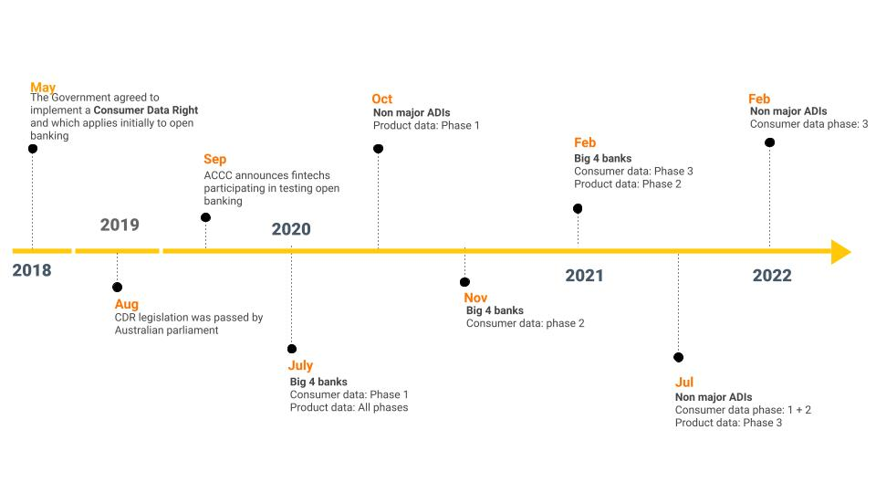

Regulations and specifications are enforced by the authorities to standardise the open banking requirements and 
evaluate the open banking compliance in their region/country.

## Open banking regulations
Open banking regulations provide a policy and legislative framework to help banks and API consumers deliver the 
benefits of open banking. 

- The Australian Government introduced the **Consumer Data Right (CDR)** to give consumers more control over their data. 
  CDR provides customers and small businesses a choice about how their data is shared with accredited data recipients 
  and sets standards for a whole industry about what data should be made available safely. In doing so, CDR encourages 
  competition between service providers, leading to better prices for customers and more innovative products and services.

- The CDR will be rolled out sector-by-sector, starting with the banking sector. Further information on the CDR is 
  available on the [Treasury website](https://treasury.gov.au/consumer-data-right). Specific examples of the benefits of 
  a CDR might include:

    - Banking applications that analyse credit card customers spending and repayment behaviours to identify the best 
      product for an individual, saving them money on high fees or obtaining better interest rates. 
    - Applications that help customers understand and manage their energy use to save money on their power bills. 
    - Comparison websites that identify a more appropriate internet or mobile phone plan taking into account each 
      customer’s actual usage and budget.
  
   
    The Australian government determined that the CDR will first apply to the banking sector, followed by the energy 
    sector and then the telecommunications sector. The introduction of CDR in the banking sector will provide consumers with 
    access to, and the ability to safely transfer, their banking data to trusted parties. The CDR will be introduced into 
    the banking sector in [phases and segments](https://www.accc.gov.au/focus-areas/consumer-data-right-cdr-0/accc-consultation-on-proposed-timetable-for-participation-of-non-major-adis-in-the-cdr).

## Consumer Data Right (CDR)

The process of rolling out Open Banking in Australia started in 2018 when the Federal Government implemented the Consumer
Data Right legislation and phased implementation was announced to gradually roll out Open Banking. In early 2020 the Big
Four banks (Commonwealth, NAB, Westpac and ANZ) were required to start making customer data available for Open Banking.
From October 1 2020, all other banks were required to start the process of making product reference data available.
By February 1, 2021 the major banks were required to have provided all data required and all other banks were are
required to make account and transaction data available by February 1, 2022. As Australia is dominated by the Big Four
banks, Open Banking is expected to shake up the Australian financial services sector. There will be much greater levels
of competition and many smaller financial institutions are set to challenge the Big Four and create a more competitive
financial services landscape.

## Consumer Data Standards (CDS)
Alongside regulations introduced in different regions, there are specifications to describe the implementation 
guidelines for the open banking requirements.  

The **Consumer Data Standards (CDS)** contain the technical standards produced by Data61, which is the Data Standards
Body that guides the banks/Data Holders on how to implement the CDR. These standards enable consumers to access and
direct the sharing of data about them with third parties flexibly and simply, and in ways that ensure security and trust
in how that data is being accessed and used.

!!! note
     WSO2 Open Banking CDS Toolkit is compliant with the Australian Consumer Data Standards. 

## Other regulations and standards

- The **General Data Protection Regulation (GDPR)** is a legal framework formalized in the European Union (EU) in 2016 
and comes into effect from 28, May 2018. GDPR effectively replaces the previously used EU Data Protection Directive (DPD).

- The **Cross-industry Prudential Standards 234 Information Security (CPS 234)** is a mandatory regulation issued by the 
Australian Prudential Regulatory Authority (APRA). The APRA regulated entities and the information assets managed by 
them and associated third parties should comply with CPS 234. WSO2 Open Banking is not an APRA regulated entity, but 
the solution can be categorized as a third-party provider that provides information assets to regulated entities. For 
more information on how the solution meets CPS 234, see [Prudential Standard CPS 234](https://www.apra.gov.au/sites/default/files/cps_234_july_2019_for_public_release.pdf).

- **Financial-grade API (FAPI)** is an industry-led specification of JSON data schemas, security and privacy protocols 
to support use cases in the financial industry and other industries that require higher security. FinTech developers can 
accelerate secure open banking with FAPI. It uses OAuth 2.0 and OpenID Connect (OIDC) as its base and defines additional 
technical requirements.