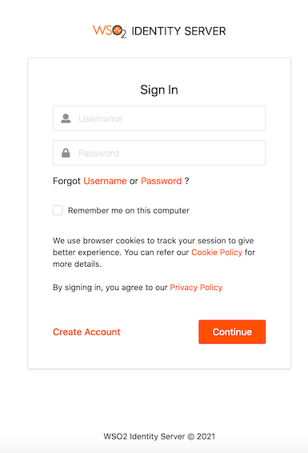
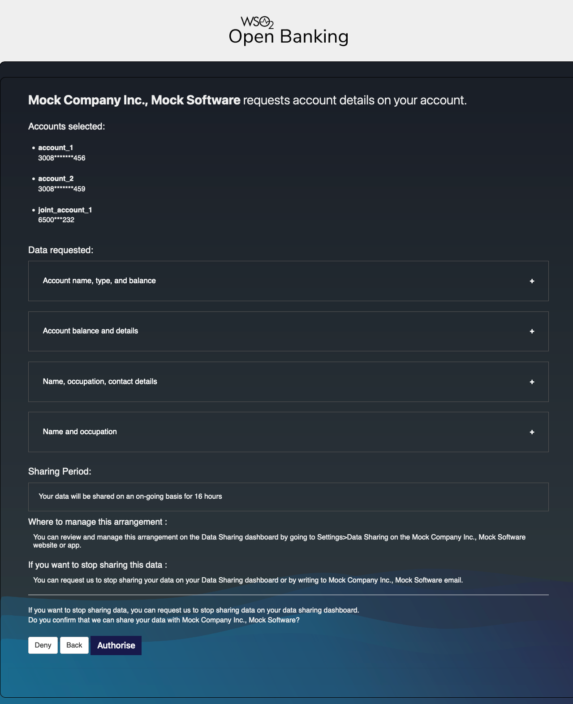

#Consent Authorization

During the consent authorization process, the Data Holder redirect customers to provide consent for Accredited Data Recipients
to access their banking information. The process is as follows:

1. Accredited Data Recipient requests to access the banking information of a customer.
2. Data Holder validates the Accredited Data Recipients request.
3. The Data Holder redirects the requested information (containing the information the Accredited Data Recipients application wants to access)
to the customer.
4. The Data Holder authenticates the customer. See below for the default login page of the consent page:
 
    
    
5. A list of bank accounts and the information that the Accredited Data Recipient wishes to access are displayed.
      
    
6. The customer can view the information before consenting or denying it. For example,
     
 
##Consent Authorization in WSO2 Open Banking 

Following components perform the consent authorization:

###Authorization endpoint
Before the Accredited Data Recipient application accesses the customer's banking information, the Accredited Data Recipients
sends an authorization request to get the customer's consent for it. The authorization request contains a request object. 
This request object is a self-contained JWT, which helps banks to validate the Accredited Data Recipient.

The method of sending the authorization request can vary as follows:

- **Send the authorization details in the authorization URL**

The Accredited Data Recipients share the request object containing the authorization details to the authorization server and obtain the 
authorization URL.

- **Send the authorization details as a reference in the authorization URL**

The Accredited Data Recipients push authorization details directly to the authorization server and obtain a reference. 
This method is also known as **Pushed Authorization**. The reference is notated by the claim; `request_uri`. Thereby, it prevents:
                                                                                         
- Intruders from intercepting the authorization information sent in the request_object
- Authorization request calls becoming bulky with the authorization details signed in the JWT

and protects the confidentiality and integrity of the authorization details when passing through an 
Accredited Data Recipients application. For more information, see [Pushed Authorization Endpoint](../learn/pushed-authorization-endpoint.md)

##Authorization web application

The Accredited Data Recipients obtain an authorization URL that redirects the customer to a web interface hosted by the Data Holder.
In this web application, the customer:

- Logs in using the login credentials.
- Views information that the Accredited Data Recipient requested to access.
- Selects the accounts that the Accredited Data Recipient can access.
- Provides consent to the Accredited Data Recipient to access the information.