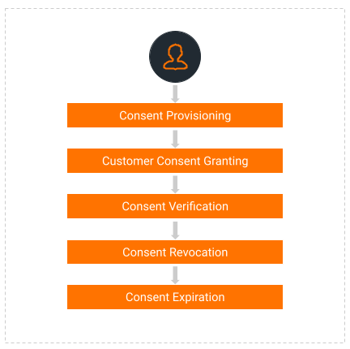

#Consent Management

Open banking is a concept that lets third-party financial service providers access customer’s financial data and 
services with their consent. Consent management is the process of prompting, collecting, and managing bank customer’s 
consent before a third-party provider collects or shares the customer's financial information. 

##Consent Lifecycle

In an open banking ecosystem, once a bank customer requests a service via an Accredited Data Recipients application for the first 
time to access the customer's data, the customer needs to authorize and grant consent. These consents go through a 
phased lifecycle as follows:

For more information on consent management lifecycle, see the [Consent Management](../get-started/open-banking-requirements.md#how-wso2-open-banking-accelerator-delivers-open-banking-requirements)
section in Open Banking Requirements.

## How to manage consents

The Accredited Data Recipient applications seek consent from their customers who wish to expose their financial data through the 
application. When granting consent the customers must know the following:

- Who they are granting access to: The identity of the Accredited Data Recipient application
- For what purpose: The details that this application will have access to. For example, account details, payment details
- For what period: Number of days the consent is valid for
- Expiration process: How the user can revoke a granted consent

Once the customer successfully agrees to the above the bank backends take over the process. The bank backend engages 
with the customer and authenticates them according to the available security mechanisms, for example, multi-factor 
authentication/Strong Customer Authentication via SMS OTP. 

After successful authentication, the customer is presented with the details of the consent where they can allow or 
deny this request from the Accredited Data Recipient application to access data. Depending on the customer’s response the API 
consumer application may or may not have access to the data. 

With the [Consent Manager](consent-manager.md) application in WSO2 Open Banking you can use one of the 
following methods to revoke these consents granted to Accredited Data Recipient applications.
 
 - A customer can revoke a consent using the Consent Manager portal 
 - A Customer Care Representative from the bank can revoke a consent on behalf of a user

##API Endpoints
 
WSO2 Open Banking uses the following API endpoints to manage consents as previously described. 

- **Consent Validation - `/validate` endpoint**  
  The solution gathers all consent details and invokes validators via this API. Once the validations are performed, 
  the flow will proceed. You can write your own validators and customize the process.  
  
- **Consent Portal - `/portal` endpoint**  
   The Consent Management portal and the Customer Care portal invoke this API to search consents and revoke consents.
    
- **Consent Management - `/manage` endpoint**  
  This component processes requests based on specification requirements. The requests are routed here and a handler 
  processes them. You can make changes to HTTPServletResponse using the same handler.
  
- **Consent Authorize - `/authorize` endpoint**  
  This endpoint can retrieve and persist consents. You can add your own steps to retrieve or persist.