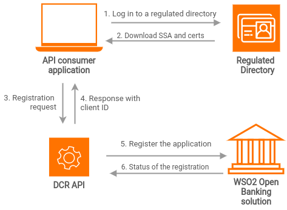

#Dynamic Client Registration 

The Dynamic Client Registration (DCR) API provides a mechanism to dynamically register OAuth 2.0 clients with 
authorization servers. With the use of the DCR API, the OAuth 2.0 client applications can register with Data Holders in a 
seamless and fully-automated process. The Accredited Data Recipient applications go through an in-depth verification during DCR to 
make sure the application is authorized and secured before sharing customers’ financial data.

The Accredited Data Recipient applications may send registration requests with a set of desired client metadata values. The Data Holder 
then provides real-time responses with a client identifier and client metadata values registered for the 
application. The application can then use the client ID in the registration information to communicate with the Data Holder. 

The Data Holder needs to provide the DCR API from its open banking solution and WSO2  Open Banking provides the 
DCR capabilities with an endpoint that performs the following:
 - Validates if the Accredited Data Recipient application is authorized by a competent authority
 - Validates information such as the role of the Accredited Data Recipient, signature algorithm, authorization scopes, 
 OAuth2.0 grant types, application type, and the request issuance time
 - Allows registered Accredited Data Recipient applications to access data via open banking APIs

!!! note 
    The Dynamic Client Registration functionality available in WSO2 Open Banking meets the 
    [Open Banking CDS](https://consumerdatastandardsaustralia.github.io/standards/#authorisation-scopes) requirements 
    including OAuth2.0 and OpenID Connect standards.

## How Dynamic Client Registration works

Accredited Data Recipient applications use the DCR API to register with a Data Holder and obtain access to open banking APIs to retrieve 
details needed for the application functionalities. It is a standard API that registers an application and responds 
with a client ID and registration details. The Accredited Data Recipient applications can use these credentials to obtain 
application access tokens that are required to invoke the open banking APIs. 

   - Before registering in the bank, the Accredited Data Recipient applications have to register with a regulated directory. 
     After successful registration, they can obtain signing and transport certificates from the directory.
   - A Software Statement Assertion (SSA) is also generated for a particular application and they can download this assertion.
   - Now, the Accredited Data Recipient applications can invoke the DCR endpoint of the desired Data Holder and register. This registration happens 
     through an API call and no prior token is expected. However, communication should take place through a channel protected by mutual TLS.
   - The registration request is an encoded JSON Web Token (JWT), which is signed by the signing certificate obtained 
     from the regulated directory. The request payload also contains the encoded and signed SSA.
   - After successful validation of the request, the Accredited Data Recipient applications receive a client ID, which 
     they can use to obtain application access tokens and access banking APIs. 
