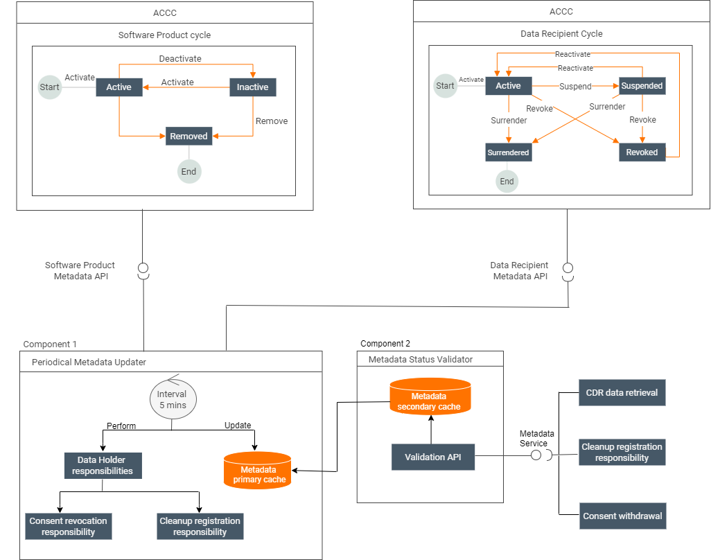

Data Holders must be able to respond to changes in the status of Data Recipients and associated software products on the 
CDR Register within 2-5 minutes of the occurrence of the change. Data Holders can accomplish this by polling APIs to 
get current statuses and check the validity of Data Recipients and associated software products, then caching these for
use during consumer data requests.

Metadata Cache Management module of WSO2 Open Banking supports:

1. Retrieving the statuses of Accredited Data Recipient (ADR) software products from the Australian Competition and
   Consumer Commission (ACCC).

2. Validating ADR and software product during:

    - Requests to disclose CDR data
    - Requests to withdraw CDR Arrangement ID
    - Consumer authorizes the CDR Arrangement ID

3. Performing Data Holder responsibilities such as revoking CDR Arrangement ID and removing client registrations.

    

### Configuring Metadata Management

By default, Metadata Cache Management is configured in WSO2 Open Banking for Australia as follows:

1. Open  the `<WSO2_OB_IAM_HOME>/repository/conf/deployment.toml` file.
2. Update the following configurations as required:

    ``` toml
    [open_banking_cds.metadata_cache]
    enable=true
    update_period=2
    data_recipients_discovery_url="https://api.cdr.gov.au/cdr-register/v1/banking/data-recipients"
    dcr_internal_url="https://<WSO2_OB_IAM_HOST>:9446/api/openbanking/dynamic-client-registration/register"
    apim_application_search_url="https://<WSO2_OB_AM_HOST>:9443/api/am/admin/v2/applications"
    http_request_retry_count=2
    dataholder_responsibilities.bulk_execution=true
    dataholder_responsibilities.bulk_execution_hour=12
    ```

    ``` toml
    [[resource.access_control]]
    context = "(.*)/api/openbanking/metadata-mgt/(.*)"
    secure="true"
    http_method="POST"
    permissions=["/permission/admin"]
    allowed_auth_handlers = ["BasicAuthentication"]
   
    [[open_banking.service_activator.subscribers]]
    subscriber="com.wso2.openbanking.cds.identity.metadata.periodical.updater.internal.MetadataScheduledTaskObserver
    ```

    - `enable` : To enable metadata caching, set the value to **true**.
    - `update_period` : Defines the fetch time for periodical cache update in minutes.
    - `data_recipient_discovery_url` :  The endpoint provided by ACCC for retrieving the statuses of Data Recipients.

        ??? tip "Click here to see a mock back end for Data Recipients Discovery endpoint..."

             ```
              {
                "data": [
                  {
                    "legalEntityId": "e41aa5af-c112-4978-9339-d91e2975715d",
                    "legalEntityName": "Regional Australia Bank Ltd.",
                    "industry": "banking",
                    "logoUri": "https://www.regionalaustraliabank.com.au/-/media/CommunityMutual/Images/Logo/regional-australia-bank-primary-logo.png",
                    "dataRecipientBrands": [
                      {
                        "dataRecipientBrandId": "af9f578f-3d96-ea11-a831-000d3a8842e1",
                        "brandName": "Regional Australia Bank",
                        "logoUri": "https://www.regionalaustraliabank.com.au/-/media/CommunityMutual/Images/Logo/regional-australia-bank-primary-logo.png",
                        "softwareProducts": [
                          {
                            "softwareProductId": "2868b3aa-762a-4aaf-9a14-02bc64c4b493",
                            "softwareProductName": "Loan Affordability Assessment",
                            "softwareProductDescription": "The Credit Affordability Assessment is a tool that analyses historical bank transactions in order to rapidly produce a summary snapshot of consumer income and expenditure to ensure data is presented in a way to assist with making responsible credit decisions.",
                            "logoUri": "https://www.regionalaustraliabank.com.au/-/media/CommunityMutual/Images/Logo/regional-australia-bank-primary-logo.png",
                            "status": "ACTIVE"
                          },
                          {
                            "softwareProductId": "12316470-f7ae-eb11-a822-000d3a884a20",
                            "softwareProductName": "myCDRdata",
                            "softwareProductDescription": "A free service to enable any consumer to discover, view and download their CDR data from a data holder",
                            "logoUri": "https://www.regionalaustraliabank.com.au/-/media/CommunityMutual/Images/Logo/regional-australia-bank-primary-logo.png",
                            "status": "ACTIVE"
                          }
                        ],
                        "status": "ACTIVE"
                      }
                    ],
                    "status": "ACTIVE",
                    "lastUpdated": "2021-07-23T00:18:02Z"
                  },
                  {
                    "legalEntityId": "b850b3ab-4096-ea11-a831-000d3a8842e1",
                    "legalEntityName": "FROLLO AUSTRALIA PTY Limited",
                    "industry": "banking",
                    "logoUri": "https://content.frollo.com.au/wp-content/uploads/2020/05/Frollo-Logo-1.png",
                    "dataRecipientBrands": [
                      {
                        "dataRecipientBrandId": "e450b3ab-4096-ea11-a831-000d3a8842e1",
                        "brandName": "Frollo",
                        "logoUri": "https://content.frollo.com.au/wp-content/uploads/2020/05/Frollo-Logo-1.png",
                        "softwareProducts": [
                          {
                            "softwareProductId": "3051b3ab-4096-ea11-a831-000d3a8842e1",
                            "softwareProductName": "Frollo",
                            "softwareProductDescription": "Frollo is a Personal Finance Management app on a quest to help people feel good about money. Through our award-winning app, we've built the simplest way to help you get your finances on track in just a few simple steps.",
                            "logoUri": "https://content.frollo.com.au/wp-content/uploads/2020/05/Frollo-Logo-1.png",
                            "status": "ACTIVE"
                          },
                          {
                            "softwareProductId": "469811b0-90d8-eb11-a824-000d3a884a20",
                            "softwareProductName": "Financial Passport",
                            "softwareProductDescription": "The Financial Passport is used to generate a picture of your current financial position and can be used when applying for loans",
                            "logoUri": "https://content.frollo.com.au/wp-content/uploads/2020/05/Frollo-Logo-2.png",
                            "status": "ACTIVE"
                          }
                        ],
                        "status": "ACTIVE"
                      }
                    ],
                    "status": "ACTIVE",
                    "lastUpdated": "2020-07-08T07:20:35Z"
                   }
                  ]
                }
             ```
    
    - `dcr_internal_url` : The endpoint of the API Manager internal URL accessing Dynamic Client Registration. 
    - `apim_application_search_url` : WSO2 API Manager application search admin endpoint that returns the
[list of client applications](https://apim.docs.wso2.com/en/latest/reference/product-apis/admin-apis/admin-v2/admin-v2/#tag/Applications/paths/~1applications/get).
    - `http_request_retry_count` : Define the retry count for http request failures, when polling the `data_recipient_discovery_url`.
    - `dataholder_responsibilities.bulk_execution` : To execute data holder responsibilities as an overnight bulk operation, set the value to true.
    - `dataholder_responsibilities.bulk_execution_hour` :  Define the bulk execution hour in 24-Hour(0 -23) time format.