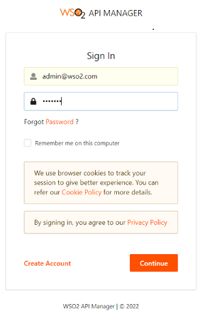
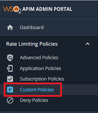

Custom throttling allows system administrators to define dynamic rules for specific use cases. When a custom throttling
policy is created, it is possible to define any policy you like. This feature is required when certain traffic thresholds
need to be freely throttled or rejected by Data Holders without impacting their performance or availability requirements.
For more details on setting the traffic thresholds, refer to [Consumer Data Standards - Traffic Thresholds](https://consumerdatastandardsaustralia.github.io/standards/#traffic-thresholds).

This page explains how to deploy a custom throttling policy for the Consumer Data Standards API.

1. Sign in to the Admin portal at `https://<APIM_HOST>:9443/admin` with administrator privileges.
       
     

2. Go to **Rate Limiting Policies** and select the **Custom Policies** tab.
     
     

3. To add a new policy, click **Define Policy**.

     

4. Enter the following policy details and click **Add**. 

    ???tip "Click here to see the full list of Custom Throttling Policies..."
        | Policy Name         | Siddhi Query            |
        | -------------       | -------------           |
        | AllConsumers        | `FROM RequestStream SELECT messageID, regex:find('^\/cds-au', apiContext) AS isEligible, str:concat(apiContext,':',cast(map:get(propertiesMap,'authorizationStatus'),'string')) as throttleKey, propertiesMap INSERT INTO EligibilityStream; FROM EligibilityStream[isEligible==true]#throttler:timeBatch(5 sec, 0) select throttleKey, (count(messageID) >= 300) as isThrottled, expiryTimeStamp group by throttleKey INSERT ALL EVENTS into ResultStream;` |

     

    !!! note
         As shown in the above Siddhi query, the throttle key must match the key template format. If there is a mismatch between 
         the key template format and the throttle key, requests will not be throttled.